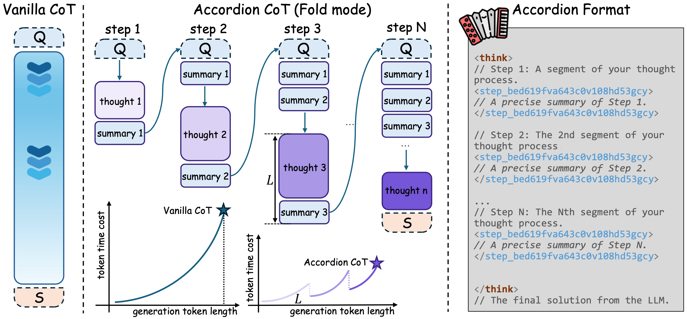

<h1 style="display: flex; justify-content: center; align-items: center; gap: 10px; margin: 0;">
  Accordion-Thinking: Self-Regulated Step Summaries for Efficient and Readable LLM Reasoning
</h1>

  <em></em>
  
  <!-- <em>**We treat DARS as the focal loss in RLVR.**</em> -->

  

<!-- # ✨Getting Started -->
